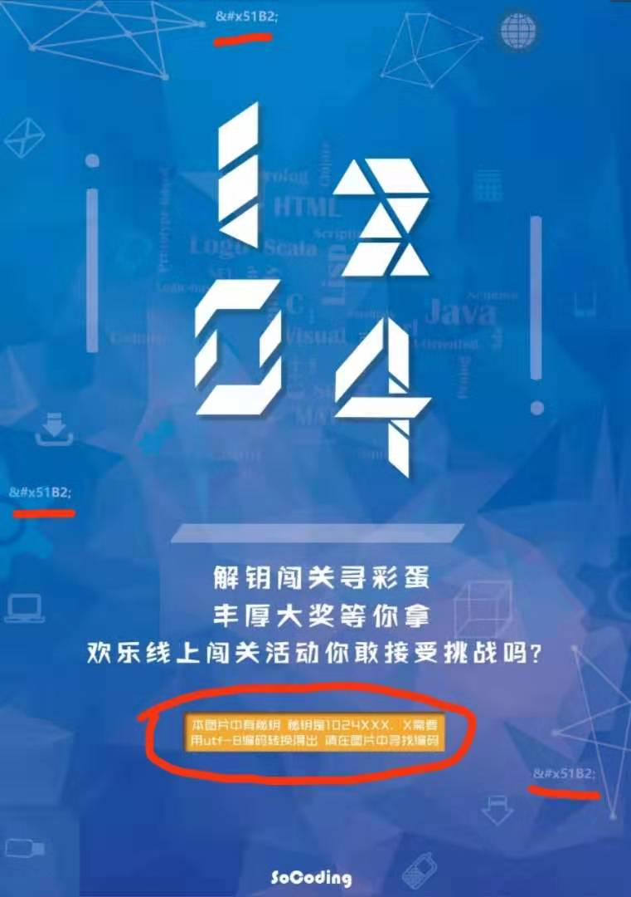
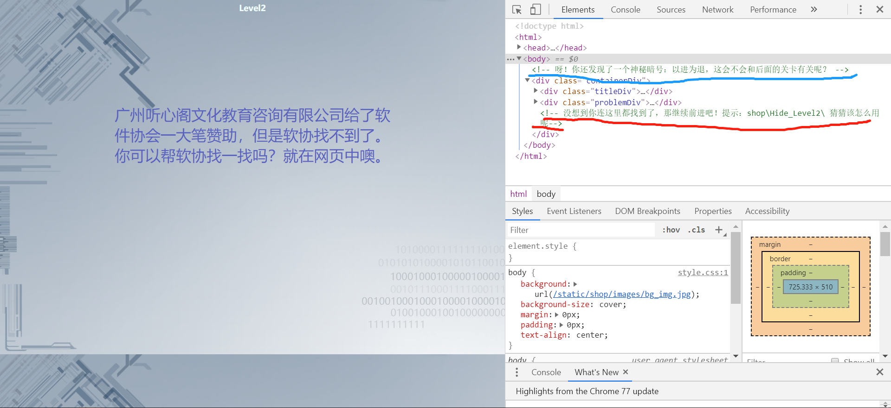
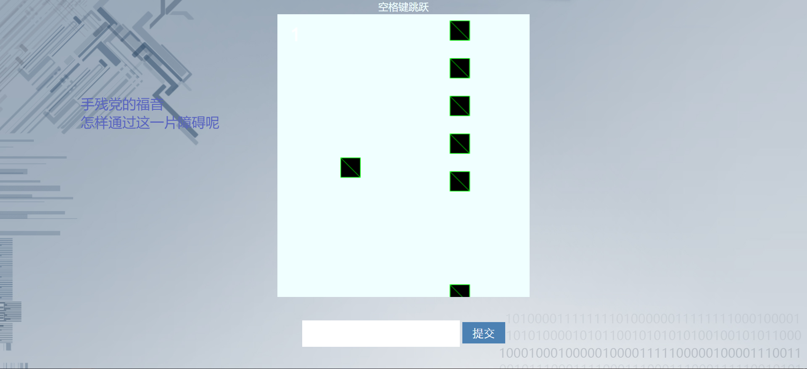
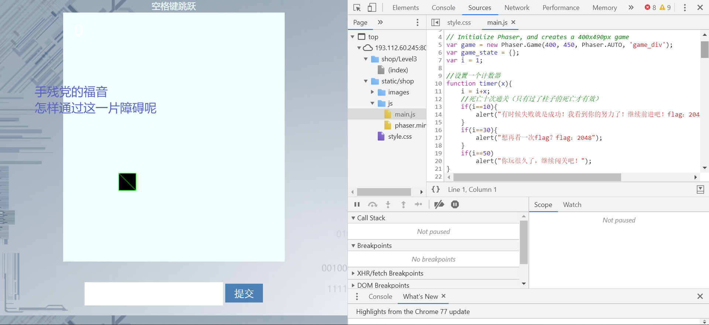
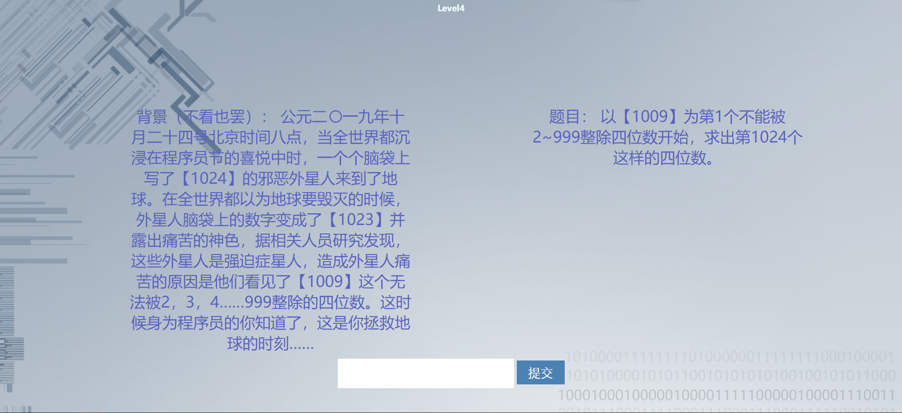
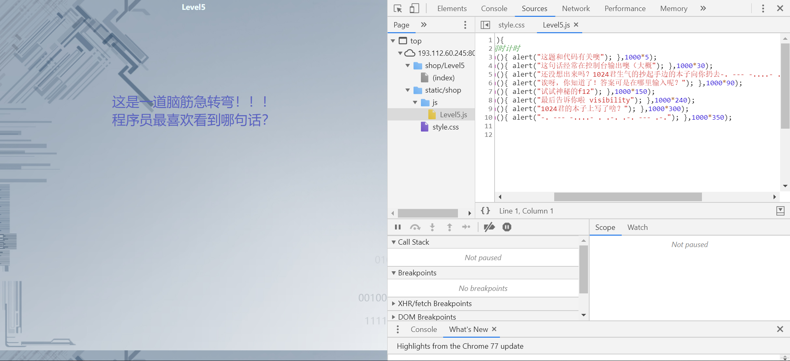
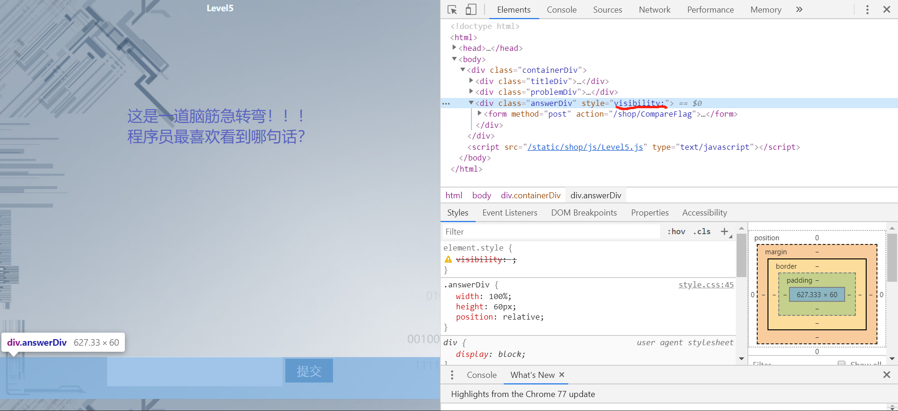
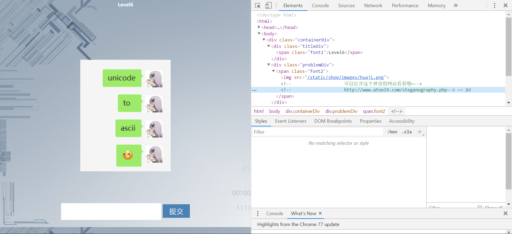
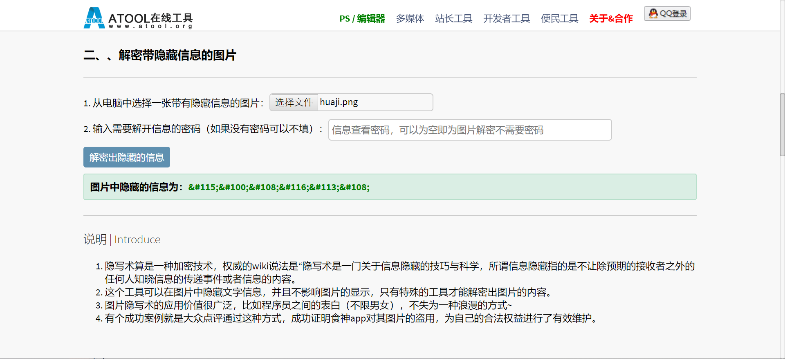
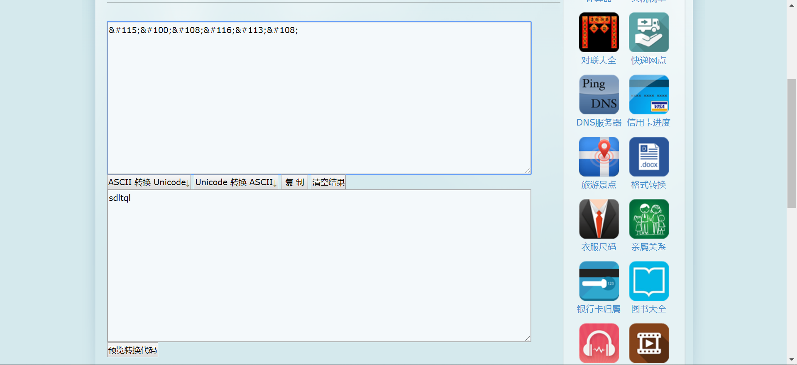

# 题解

## Level 1

直接看海报，海报上啥都有（滑稽
    
Flag：`1024冲冲冲`
    

    
## Level 2

网页中啥也找不到... 可以百度一下我们的赞助商支持一下。打开开发者工具（F12），发现里面有奇怪的注释！

根据提示将 URL 改写进入隐藏的第二关解数独（可以使用数独解题器

Flag：`192478653`




## Level 3

玩就完事了！一直玩就过了！

还是打开开发者工具，发现 Js 文件中有一行注释//死亡十次通关（丧心病狂




## Level 4

别问，问就是自己写。

Flag：`9649`



```c
#include <stdio.h>
int main() {
    int n = 0, flag;
    for (int i = 1009; i <= 9999; i++) {
        flag = 0;
        for (int j = 999; j >= 2; j--) {
            if (i % j == 0) {
                flag = 1;
                break;
            }
        }
        if (flag == 0) {
            n++;
            if (n == 1024) {
                printf("%d\n", i);
                return 0;
            }
        }
    }
    return 0;
}
```

## Level 5
这是一关无法盲猜的脑筋急转弯。我知道你们都会想“0 error(s), 0 warning(s)”。嘿嘿

可以等待也可以直接打开 Js 文件发现摩斯密码。解出摩斯密码，再通过提示找到 input 框并使之出现。

输入！通过！

Flag：`NO ERROR`





## Level 6

在源码中找到网址，发现了一个图片影写网站！悄咪咪的把页面中的微信图保存并解密，得到一串 Unicode。

根据提示将 Unicode 转换成 ASCII，完成！sqltql！

Flag：`sqltql`






## Level 7

> 非常抱歉，当初测试时没有留意到腾讯云开发者文件分享功能有文件下载次数限制，导致活动当天多次出现资源不可用的问题，作为本关卡负责人，在这里向大家说声对不起。需参与活动重现的同学注意：文件已经迁移回 GitHub，下载页也重新改到 [Release 页](https://github.com/bobby285271/1024/releases/)，下载速度可能会变慢，敬请谅解。

四处浏览给出的 GitHub 仓库（本意是给你们强行安利 GitHub），发现 [#1](https://github.com/bobby285271/1024/issues/1) 中有文件可供下载。

解压下载好的压缩包，点开里面的二进制文件，注意到一路回车下去是得不到 Flag 的。

于是... 还是 Js 文档（`renderer.js`），注意到第 44 行有六连问的答案，~~昧着良心作答就是了。~~

```
else if (u == 5 && q[0] == "写完了" && q[1] == "写完了" && q[2] == "准备好了" && q[3] == "学完了" && q[4] == "刷完了" && value == "我还提前AK了呢") {...}
```

提示 [1] [0] [2] [4] 数组下标，返回 Js 源码留意到一个~~非常明显的~~ `key` 数组，将 `key[1]` `key[0]` `key[2]` `key[4]` 的值连接，得到 `56AB24C15B72A457069C5EA42FCFC640`。

接着会询问 "Il1lIIllIl1Il1I1l1IIlIl1IlllI1Il1IlllI1l1IIl1IIl1IIl1IIIlIIllllIl11lII1Ill 请问这里一共有多少个 I？"，将字符串复制粘贴到任意编辑器，使用查找功能即可。本题 29 和 30 均给过（"`Il1lIIllIl1Il1I1l1IIlIl1IlllI1Il1IlllI1l1IIl1IIl1IIl1IIIlIIllllIl11lII1Ill`" 这里有 29 个 I，"`Il1lIIllIl1Il1I1l1IIlIl1IlllI1Il1IlllI1l1IIl1IIl1IIl1IIIlIIllllIl11lII1Ill 请问这里一共有多少个 I？`" 这里有 30 个 I，没想到吧）。

提示加密方式为 MD5，解密得到 Flag。

Flag：`happy`

## 彩蛋

彩蛋藏在了 Level 7 里面，既然你进了 GitHub 的一个仓库，下载的文件里面又有 `.git` 目录。~~难道你就没有跑一跑 `git log` 的冲动吗？~~

```
[bobby285271@fedora socoding-1024-level7]$ git log
commit 24564c195013169a57f211a1a2c37b7c68927e8a (HEAD -> master)
Author: Bobby Rong <邮箱被和谐了>
Date:   Tue Oct 22 19:53:30 2019 +0800

    //手动滑稽

commit 9a262a2fdc06f248848f979bd089761969044780
Author: Bobby Rong <邮箱被和谐了>
Date:   Tue Oct 22 19:49:40 2019 +0800

    居然被你发现了!
    恭喜你找到了彩蛋: 666

```

Flag：`666`

# 致谢

首先感谢所有参加我们活动的同学，是你们的参与使得这个活动能够继续下去。

感谢软协 1024 青龙项目组的每一位同学，以及软协其他成员对我们的帮助。

特地鸣谢 ag、jz 两位工具人给予我们的巨大帮助。

感谢广州听心阁文化教育咨询有限公司对本次活动的大力支持。 

## 大家明年 1024 见！

~~那么明年又该轮到谁（复数）接锅了呢？~~


                                
